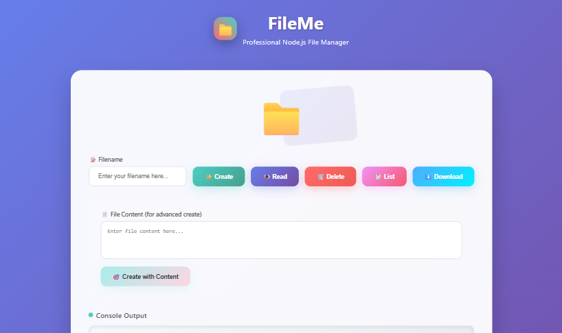
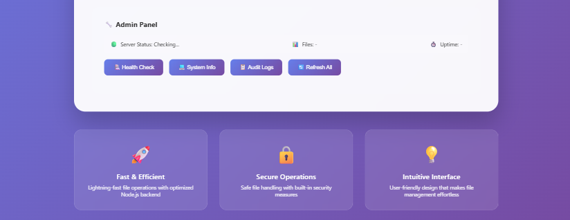

# 📁 FileMe - Professional Node.js File Manager

  
A lightweight, beautiful file management tool built using **Node.js core modules** (HTTP, FS, and Path). FileMe offers essential file operations through a user-friendly web interface and an efficient backend—perfect for learning or real-world Node.js use cases.

---

## 🚀 Features

- ⚡ **Fast & Efficient**  
  Lightning-fast file operations powered by Node's asynchronous backend.

- 🔐 **Secure Operations**  
  File handling with built-in safety measures to prevent misuse.

- 💡 **Intuitive Interface**  
  Modern, responsive UI with action buttons for easy file management.

- 🖥️ **Admin Panel**  
  Real-time server health checks, file counts, uptime tracking, and more.

---

## ✨ Screenshots

### 🔸 UI Overview

> 📁 Place your images in a `screenshots/` folder inside your repo for these links to work, or replace with hosted URLs (e.g., from GitHub Issues or Imgur).

---

## 🧠 Tech Stack

- **Node.js** – Core modules only (no external packages!)
- **HTML + CSS** – Fully custom frontend (no frameworks)
- **JavaScript** – Button-driven frontend logic via `fetch()` API

---

## 📂 Functionalities

| Function     | Route              | Method | Description                        |
|--------------|-------------------|--------|------------------------------------|
| Create File  | `/create?name=`    | GET    | Creates a blank file               |
| Read File    | `/read?name=`      | GET    | Reads content of the file          |
| Delete File  | `/delete?name=`    | GET    | Deletes specified file             |
| Create + Content | `/createWithContent` | POST | Creates file with user content     |
| List Files   | `/list`            | GET    | Returns list of all files          |
| Download     | `/download?name=`  | GET    | Downloads selected file            |

---

## 📦 Project Structure

